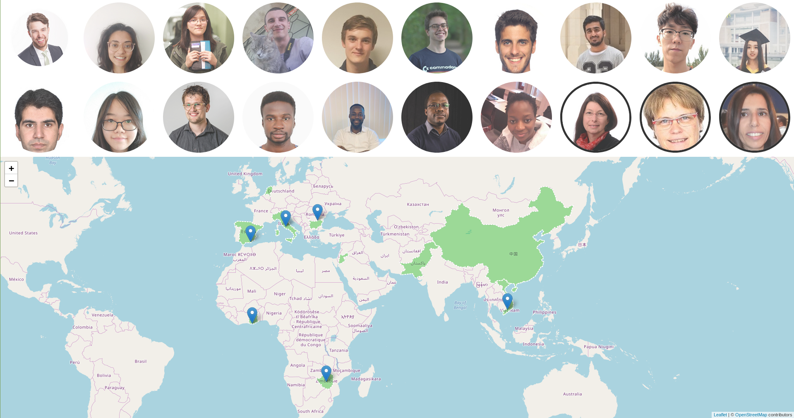
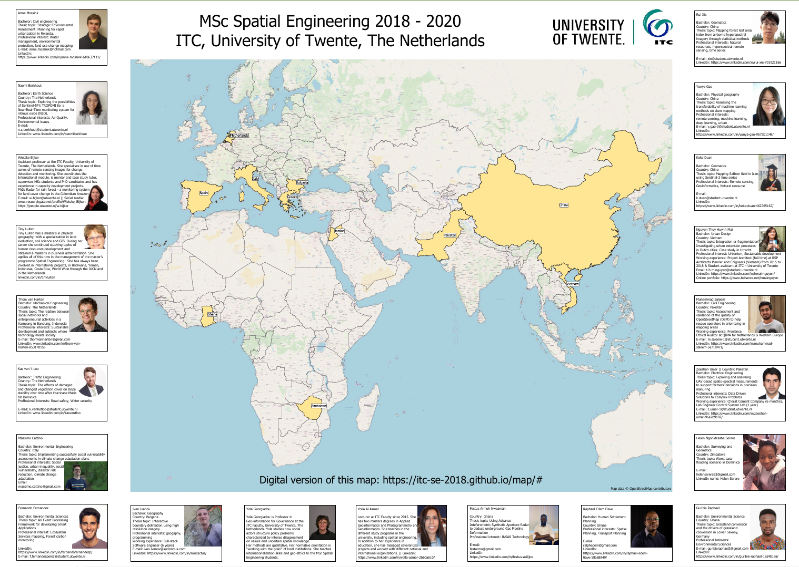

# Spatial Engineering 2018 Business Card

> Interactive map showing the locations, background and interests of all the MSc Spatial Engineering 2018 students at ITC, Univesity of Twente, Netherlands.


## Install

Just clone the repository. No build, no preprocessing, no install.
```
git clone https://github.com/map/itc-se-2018
```

## Demo

[Map](https://itc-se-2018.github.io/map/)

## Poster

There is also a printable version, that might not be up-to-date, but looks better when printed.



## Contributing

Fixes from my fellow classmates accepted.

## License

[MIT](../LICENSE) © Ivan Ivanov - suricactus
